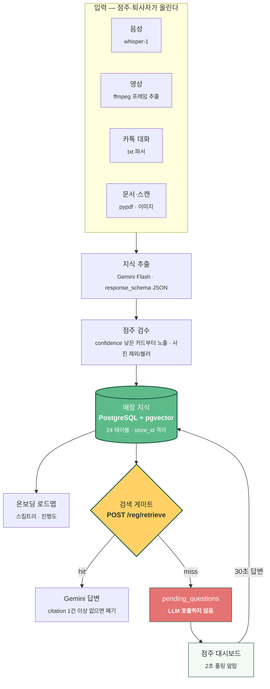

<div align="center">


# AskBuddy

**카페 등 소규모 매장의 업무 인수인계를 AI가 대신한다.**

점주가 음성·영상·카톡·문서를 올리면 지식카드로 정리되고, 신입은 로드맵과 채팅으로 배운다.

<a href="https://ask-buddy-iota.vercel.app"></a>


<sub>2026 유니톤(Unithon) 해커톤 · 3인 팀 프로젝트</sub>

</div>

---

## 무엇을 푸는가

카페의 신입 교육은 대부분 사람의 기억에 남아 있다. 가르치던 사람이 나가면 그대로 사라진다.
남은 사람은 같은 질문을 매번 다시 받고, 신입은 눈치가 보여 세 번째부터는 묻지 않는다.

AskBuddy는 그 인수인계를 매장의 자산으로 바꾼다.

**승인된 매장 지식만 근거로 답한다. 근거가 없으면 추정하지 않고 점주에게 넘긴다.**

이건 성능의 한계가 아니라 설계 선택이다. 무대 위에서 그럴듯한 오답은 "모르겠다"보다 나쁘다.
매장 운영에서는 더 그렇다 — 알레르기 응대나 마감 절차를 지어내면 실제 사고가 난다.

## 핵심: 모른다고 답하는 순간이 지식이 자라는 경로

```
신입이 묻는다
  └─ 지식에 근거가 없다 → AI가 답하지 않는다 ("사장님께 확인 중")
       └─ 점주 폰에 알림
            └─ 점주가 30초 답한다
                 └─ 그 답이 매장의 영구 지식이 된다
                      └─ 다음 알바는 같은 질문을 하지 않는다
```

이 순환을 닫는 것이 제품의 정의다. 구현 우선순위가 충돌하면 항상 이쪽을 택했다.

## 아키텍처



**브라우저는 DB도 LLM도 직접 만지지 않는다.** 모든 접근은 FastAPI를 지나고, 파일 바이너리만 서명 URL로 Supabase Storage에 직접 올라간다. Next.js 쪽에는 LLM 키도 DB 자격증명도 두지 않았다.

## 엔지니어링 노트

### 1. 벡터 유사도만으로는 "어디 있어요?"를 가를 수 없었다

`주차 자리 어디예요?`와 `컵은 어디 있어요?`는 임베딩 거리가 0.5 넘게 붙는다. 둘 다 위치를 묻는 한국어 문장이라 말투가 같기 때문이다. 실측에서 이 오답이 정답 카드 8개보다 높은 점수를 받았다.

임계값만 조정해서는 풀리지 않았다. 올리면 정답이 죽고, 내리면 오답이 산다.

갈라주는 건 말투가 아니라 **무엇을 묻느냐**였다. 그래서 벡터 점수 위에 앵커 낱말 검사를 얹었다 — 질문에서 조사·어미를 떼고 남은 실질 낱말이 카드 본문에 실제로 등장하는지 본다. 주차는 어느 카드에도 없고, 컵은 있다.

```python
# api/app/reg/retrieve.py
if score < strong and anchors and not _grounded(anchors, card_text):
    continue    # 점수는 넘겼지만 묻는 대상이 카드에 없다 → 후보에서 제외
```

다만 점수가 아주 높으면(`0.62` 이상) 낱말이 안 겹쳐도 통과시킨다. `아아`와 `아이스 아메리카노`처럼 같은 것을 다르게 부르는 경우를 막지 않기 위해서다.

### 2. `miss`일 때 LLM을 부르지 않는 것을 계약으로 고정했다

검색 게이트가 `miss`를 반환하면 그 요청은 거기서 끝난다. "그래도 뭔가 답해보자"는 유혹을 코드 레벨에서 차단했다. 답변 메시지는 `message_citations`가 1건 이상일 때만 저장되고, 0건이면 이미 생성된 답변도 폐기한다.

### 3. RLS를 쓰지 않고 매장 격리를 API 코드가 전담한다

Supabase를 쓰면서도 RLS를 도입하지 않았다. 정책이 DB와 코드 두 곳에 흩어지면 해커톤 일정에서 어느 쪽이 진짜인지 추적이 안 된다고 판단했다. 대신 규칙을 좁게 못 박았다 — 모든 DB 함수는 `store_id`를 **필수 인자**로 받고(기본값·`Optional` 금지), `store_id`는 요청 본문이 아니라 **JWT에서 꺼낸 값**만 쓴다.

### 4. '신뢰도 %'를 사용자에게 보여주지 않는다

초기 기획에는 답변마다 신뢰도 퍼센트를 띄우는 화면이 있었다. 산출 근거를 사용자에게 설명할 수 없는 숫자여서 폐기했다. 대신 **'매장 지식 완성도'** — 등록된 카테고리 중 필수 항목이 채워진 비율 — 를 보여준다. 내부 `confidence` 값은 점주 검수 화면의 정렬에만 쓴다.

## 화면 흐름

| 역할 | 흐름 |
|---|---|
| 점주 | 가입 → 업종·목표 선택 → 카테고리 선택 → **자료 업로드(게이지 80% 이상)** → 미리보기·검수 → 초대코드 발급 |
| 점주 | 대시보드 — 직원 진행도 · 미답변 질문 알림 → 30초 답변 |
| 신입 | 초대코드 합류 → 온보딩 로드맵(스킬트리) → Buddy 채팅 → 단계 완료 |

업로드 게이지 가중치는 음성 +20 · 영상 +30 · 텍스트 +20 · OCR +10이고, **80% 이상**에서 미리보기가 열린다. 자료 커버리지가 곧 답변 정확도라서 게이트를 앞단에 뒀다.

## 기술 스택

| 영역 | 사용 |
|---|---|
| 백엔드 | FastAPI · Python 3.12 · asyncpg |
| 프론트 | Next.js 16.3 (App Router) · React 19 · TypeScript · Tailwind 4 |
| DB | PostgreSQL 15 + pgvector (Supabase) · 24 테이블 |
| 임베딩 | OpenAI `text-embedding-3-small` (1536차원) |
| STT | OpenAI `whisper-1` |
| 멀티모달 추출 | Gemini Flash (`response_schema` 강제 JSON) |
| 파일 | Supabase Storage 비공개 버킷 · 서명 URL 업로드 |
| 배포 | Vercel (web) · Railway (api, ffmpeg 포함 Dockerfile) |

## 팀과 기여

3인 팀. 폴더 소유권을 나눠 브랜치 충돌을 구조적으로 막았다.

| 파트 | 범위 |
|---|---|
| **DB · 인증 · 검색 · 학습 API** — [@kim-kwanho](https://github.com/kim-kwanho) | `db/`, `api/app/reg/`, `api/app/auth/`, `api/app/learn/` |
| 인제스트 파이프라인 | `api/app/ingest/`, `api/prompts/` |
| 프론트엔드 | `web/` |

**내가 맡은 부분**

- **스키마 설계** — 24 테이블 + pgvector 인덱스, `match_cards` 검색 함수, 데모 시드
- **인증** — 이메일 가입·로그인(role DB 대조), 매장 생성, 초대코드 발급·합류
- **검색 게이트** — `POST /reg/retrieve` 단일 진입점, 임계값 분리(`RETRIEVAL_THRESHOLD`), 위 앵커 낱말 그라운딩
- **미답변 순환 백엔드** — `pending_questions` 적재 → 점주 답변 → 카드 갱신 → 로드맵 배지 해제까지의 `api/app/learn/` 전 구간
- 로드맵·대시보드 프론트 연동 (진행도·직원 수를 DB에서 읽도록)

## 로컬 실행

```bash
# 1. DB
supabase start
psql "$SUPABASE_DB_URL" -f db/001_init_schema.sql
psql "$SUPABASE_DB_URL" -f db/002_seed_demo.sql

# 2. API
cd api && python3 -m venv .venv && source .venv/bin/activate
pip install -r requirements.txt
cp .env.example .env              # 키 채우기
python scripts/init_storage.py    # 버킷 생성. 최초 1회
python scripts/seed_embeddings.py # 시드 카드 임베딩
uvicorn app.main:app --reload --port 8000

# 3. WEB
cd web && pnpm install && cp .env.example .env.local && pnpm dev
```

→ web `localhost:3000` · api docs `localhost:8000/docs`

LLM 키 없이도 전 구간이 돈다 (`INGEST_MODE=mock`).

**동작 확인**

```bash
# hit — 근거 카드가 있다
curl -X POST localhost:8000/reg/retrieve -H 'Content-Type: application/json' \
  -d '{"store_id":"demo-cafe","question":"우유 어디 보관해요?","top_k":5}'

# miss — 근거가 없다. LLM을 부르지 않는다
curl -X POST localhost:8000/reg/retrieve -H 'Content-Type: application/json' \
  -d '{"store_id":"demo-cafe","question":"환불은 어떻게 해요?","top_k":5}'
```

## 문서

| 파일 | 내용 |
|---|---|
| [`docs/AskBuddy_개발가이드.md`](./docs/AskBuddy_개발가이드.md) | 아키텍처·계약·결정 근거. 정본 |
| [`docs/ingest-contract.md`](./docs/ingest-contract.md) | `/ingest/*` 계약. 업로드 3단계·에러 코드 |
| [`docs/team-workflow.md`](./docs/team-workflow.md) | 브랜치 전략·폴더 소유권·충돌 대응 |
| [`docs/AskBuddy_환경세팅.md`](./docs/AskBuddy_환경세팅.md) | 파트별 환경 구성 |
| [`db/001_init_schema.sql`](./db/001_init_schema.sql) | 스키마 원천 |
| [`CLAUDE.md`](./CLAUDE.md) | AI 코딩 에이전트용 세션 컨텍스트 |

## 라이선스

[MIT](./LICENSE)
